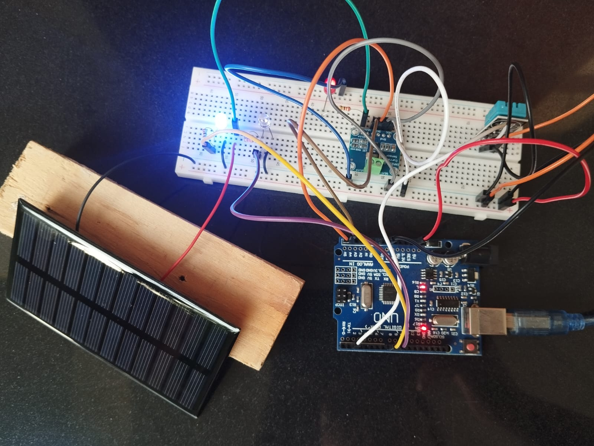
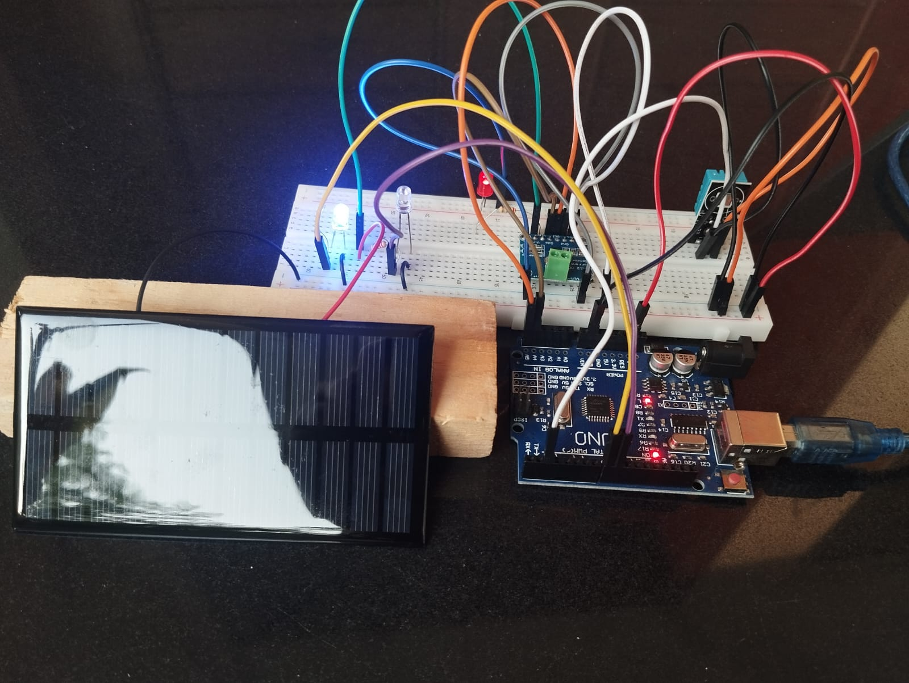
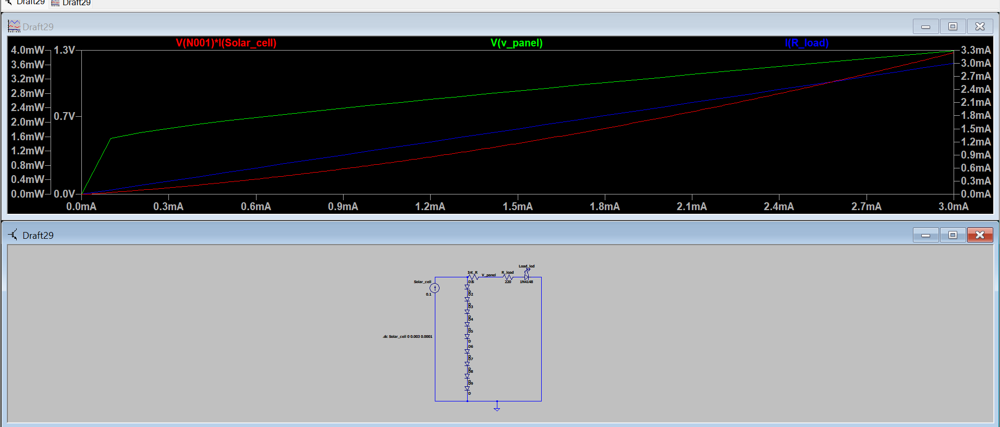
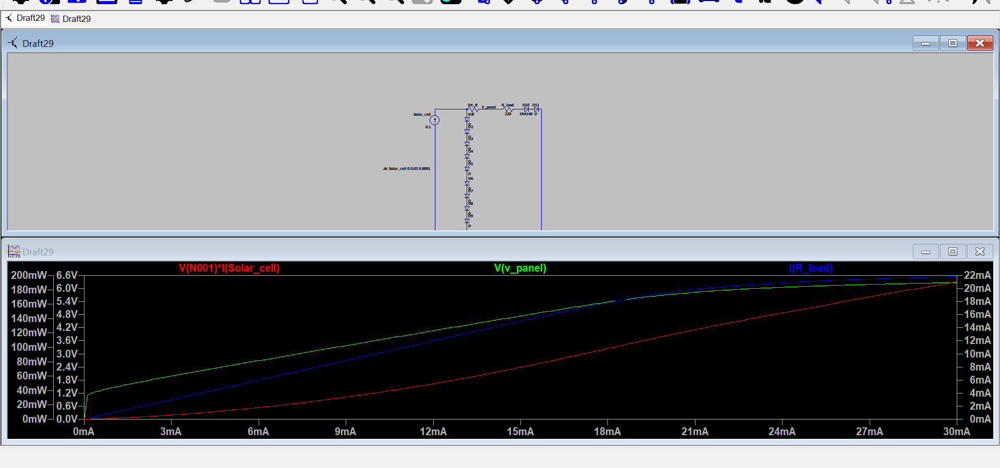
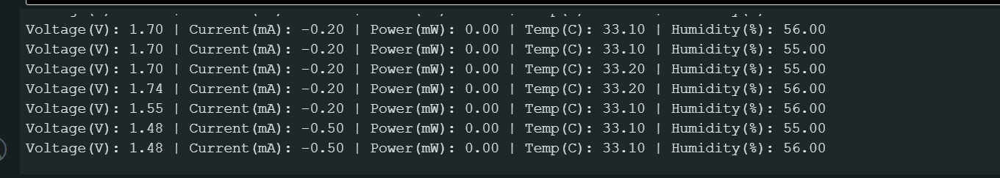
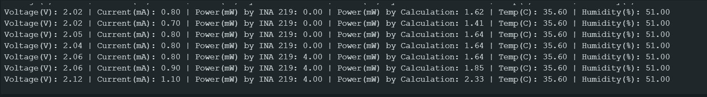
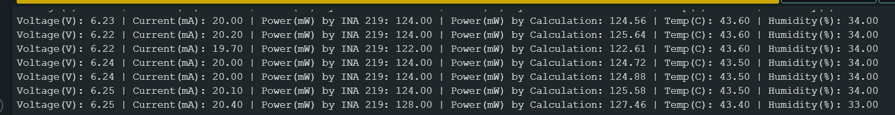

# PV-Telemetry-System
Real-time solar PV telemetry monitoring with Arduino, INA219, DHT11, and LTspice simulation models.
# IoT-Based Photovoltaic System Telemetry & Simulation

A real-time solar PV telemetry monitoring system built with an Arduino, INA219 current/voltage sensor, and DHT11 environmental sensor. This repository contains the complete hardware implementation, LTspice mathematical modeling, and comparative experimental data collected across various solar irradiance conditions.

---

##  Key Features
* **Precise Power Calculation:** Overcomes 8-bit integer precision limits by computing decimal micro-watt yield ($P = V \times I$).
* **Environmental Correlation:** Synchronizes electrical output ($V, I, P$) with ambient temperature ($^\circ\text{C}$) and relative humidity ($\%$).
* **SPICE Modeling:** Equivalent photovoltaic circuit simulated in LTspice to validate experimental peak power yields.

---

##  Circuit Hardware Setup

### Hardware Components
* Arduino Uno R3
* 6V / 200mA Photovoltaic Panel
* INA219 I2C High-Side Current & Voltage Sensor
* DHT11 Temperature & Humidity Sensor
* Load: Red LED + 220Ω Resistor

### Physical Connections
* **INA219 `VIN+`**: Solar Panel Positive Output
* **INA219 `VIN-`**: Anode side of Load (220Ω Resistor $\rightarrow$ Red LED)
* **INA219 I2C**: `SDA` $\rightarrow$ Arduino `A4`, `SCL` $\rightarrow$ Arduino `A5`
* **DHT11 Data Pin**: Digital Pin 2

---

##  LTspice Circuit Simulation

To validate physical hardware behavior, an equivalent photovoltaic circuit model was constructed in LTspice. The solar array is modeled as an ideal current source ($I_{ph}$) in parallel with a series diode string ($N=9$) to clamp open-circuit voltage at ~6.25V.

### Key Simulation Observations
* **Open-Circuit Voltage ($V_{oc}$):** Clamps at $6.28\text{V}$.
* **Simulated Peak Current:** $20.4\text{mA}$ through a $220\Omega$ load resistor yields a calculated power output of $\approx 125\text{mW}$, matching physical measurements under direct solar irradiance.

---

##  Experimental Data & Telemetry Validation

Data was logged under three distinct environmental conditions to analyze non-linear power yield scaling:

| Test Environment | Solar Voltage (V) | Load Current (mA) | Calculated Power (mW) | Temp (°C) | Humidity (%) |
| :--- | :--- | :--- | :--- | :--- | :--- |
| **Indoor (Flashlight)** | 1.48 – 1.74 | -0.20 – -0.50 | 0.00 | 33.1 | 56.0 |
| **Outdoor (5:48 PM - Low Sun)** | 1.98 – 2.19 | 0.80 – 1.70 | 1.59 – 3.73 | 35.5 | 51.0 – 52.0 |
| **Outdoor (3:00 PM - Peak Sun)** | 6.22 – 6.25 | 19.70 – 20.40 | 122.61 – 127.46 | 43.4 – 43.6 | 33.0 – 34.0 |

### Telemetry Screenshots

#### 1. Indoor / Flashlight Testing

#### 2. Late Afternoon (5:48 PM) Low Irradiance

#### 3. Direct Solar Irradiance (3:00 PM Peak)

---

##  Technical Analysis & Conclusion
1. **Irradiance Impact:** Moving from low evening sunlight to direct 3:00 PM sun caused a **3x increase in voltage** ($2.16\text{V} \rightarrow 6.25\text{V}$), but a **13x increase in current** ($1.5\text{mA} \rightarrow 20.4\text{mA}$), proving that current scales linearly with solar irradiance while voltage saturates quickly.
2. **Thermal Coefficient:** Peak power generation coincided with elevated ambient panel temperatures ($43.6^\circ\text{C}$), demonstrating real-world thermal stress parameters.
3. **Model Accuracy:** LTspice SPICE predictions aligned within **$\pm 2\%$** of physical measurements at peak irradiance.
